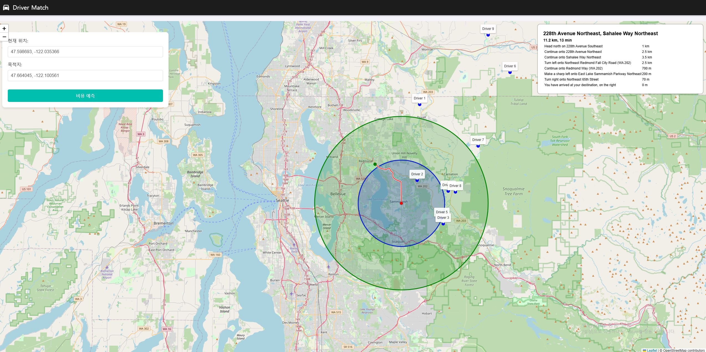

# Uber-like App

## Run
### BE

0. Proto file build
.\src\proto_compile.bat

1. GRPC Gateway

```
.\src\grpc-gw\grpc-gw.exe
```

2. Location App
```
.\src\serverpoetry run python http_server.py --port=50050 --service=location
```

3. Matching App
```
.\src\server\poetry run python http_server.py --port=60050 --service=match
```

4. LB for Location App

```
.\src\lb\docker-compose up --build -d
```


5. Random Driver Location Report
.\src\test\random_driver.py

6. Client
.\src\test\map_fe.html


