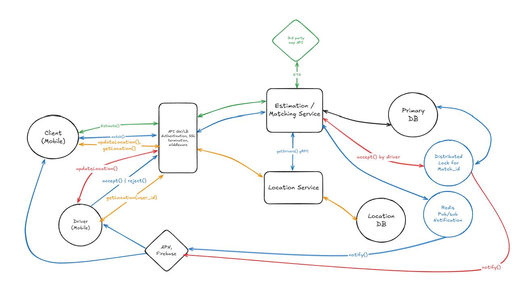

# Uber App Design

## Requirements

1. Functional requirements
```
    - User: Request / Cancel a matching for a riding
    - Driver: Reject / Accept a matching
    - Estimating the ETA and fare 
    - User / Driver should be able to track where the Driver | User is
    - Driver: Start / Complete a riding
```
2. NFR
```
    - Matching should be 1 on 1 at a time, #during the matching process as well
    - Request should be delivered at least once
    - Scalability --> flexible 
```

## Entities
```
1. User | Driver
2. Role {
    role_id,
    role: "Driver" | "User"
}

3. Match {
    match_id,
    driver_id,
    esitmation_id,
    final_fare,
    final_ta,
    status: "Requested" | "Accepted" | "Riding" | "Completed",
    range,
}
4. Estimation {
    esitmation_id,
    user_id,
    starting_location,
    destination,
    created_at,
    eta,
    estimated_fare,
    status: "Requested" | "Canceled"
}

5. Location {
    user_id,
    lat,
    lng,
    created_at
}
```

## API design
    - User: Request / Cancel a matching for a riding
    - Driver: Complete a riding, Starting riding

    ```
    POST /api/v1/match -> SuccessResponse(Match)
    Body {
        esitmation_id
    }
    Response, 201 {
        success: True,
        response: Match
    } | {
        success: False,
        message:str
    }
    
    PATCH /api/v1/match/{match_id} -> SuccessResponse(Match)
    Body {
        status: "Cancel"
    }
    Response, 200 {
        success: True,
        response: Match
    }
    
    - Driver: Reject / Accept a matching
    POST /api/v1/match/{match_id}/reject 
    Body {}
    Response, 200 {
        success: True,
        response: None
    }

    POST /api/v1/match/{match_id}/accept -> SuccessResponse(Match)
    Body {}
    Response, 200 {
        success: True,
        response: Match
    }

    - Estimating the ETA and fare 

    POST /api/v1/estimation/ -> SuccessResponse(WireModelEsitmation)
    Body {
        starting_location,
        destination
    }
    Response, 200 {
        success: True,
        response: WireModelEsitmation# Estimation with less fields
    }

    - User / Driver should be able to track where the Driver | User is

    POST /api/v1/location
    Body {
        lat,
        lng,
    }

    GET /api/v1/location/{user_id} -> SuccessResponse(Location)
    Response, 200 {
        success: True,
        response: Location
    }
    ```


## High level design

Initial Design

